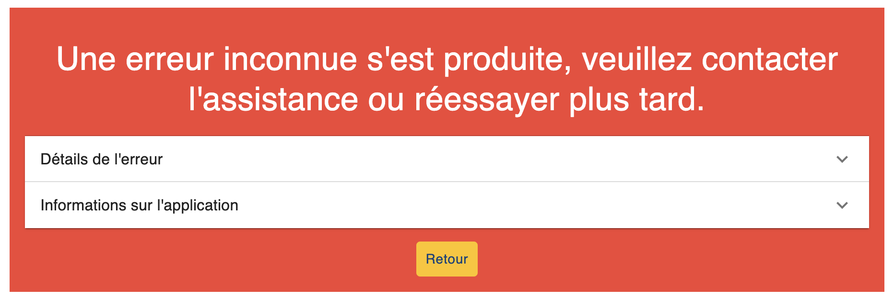

# Getting Started

## Quick Start

```bash
// Git clone the master branch of the v2 version
git clone -b v2-master git@github.com:InseeFr/Stromae.git
cd Stromae
// Download dependencies
yarn
// Launch VSCODE
code .
yarn start
```

You must see this screen with an error :



This error is caused by the authentification provider which received an invalid environnement value.


A quick fix is to modify the `build-configuration.json` file located in public directory [see](getting-started.md#environnement-values) for further information.

```json title="public/build-configuration.json"
{
  // highlight-start
  //"authenticationType": "${AUTHENTICATION_TYPE}",
  "authenticationType": "NONE"
   // highlight-end
  "_authenticationType_comment_": "Authentication type : OIDC or NONE",
  "apiUrl": "${API_URL}",
  "portail": "${PORTAIL_URL}"
}
```

## 404 Pages

Once your ready, you must redirected to a 404 page.


This is the correct behavior. Stromae is an application included in an IS with a micro service architecture. The respondents are redirected to Stromae with query param in the url.

There is however a visualization page at the root `visualize` (http://localhost:3000/visualize). It is visualization, there is no persistent data, authentication (even if it is enabled) etc...

## Environnement values

Due to an old strange delivery constraint in production, environment variables are managed with json static files in the public folder.

The environment variables related to authentication to keycloak are present in the `keycloak.json` file and the others in the `configuration.json` or `build-configuration.json` file

Today, in Stromae V2, the `configuration.json` file has no use and could be removed.

A work on environnement value could be very useful. We should be able to manage environment variables in the classical way with `.env` files.

### Local configuration

To have a local configuration there is a trick. Use a file `configuration-local.json` and `keycloak-local.json` which are not commited because added to the [`.gitignore`](https://github.com/InseeFr/Stromae/blob/083b8d05f51150cba6fcbdc6d89fda70121057ce/.gitignore#L21-L23).

Then, you have to run this following CLI

```bash
cp .env .env.local
echo REACT_APP_NAME_CONFIG_FILE=configuration-local.json >> .env.local
echo REACT_APP_NAME_OIDC_FILE=keycloak-local.json >> .env.local
cp public/build-configuration.json public/configuration-local.json
cp public/keycloak.json public/keycloak-local.json
```

and to modify `public/configuration-local.json` and `public/keycloak-local.json` file as expected.

## Node 18

The project is not currently supporting node 18. This is a known issue which need to be solved. You can use node 16 instead.
