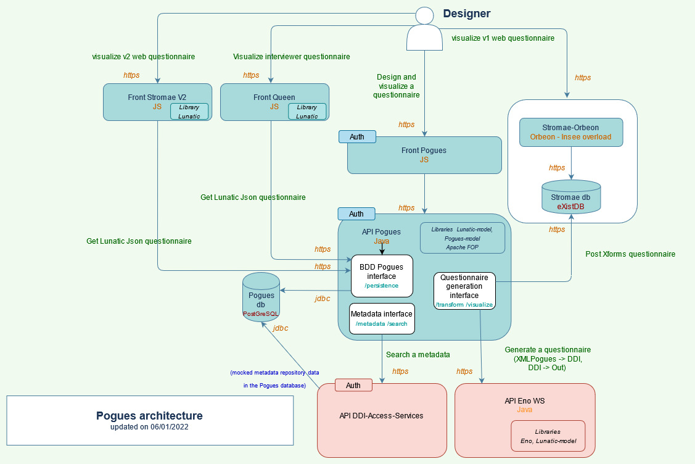

# Survey Design Workbench Product

The survey design workbench product is part of the new survey chain composed of 4 products

- The Collection platform product
- The Survey Design Workbench product
- The Post-collection processing product
- The collection preparation product

## Software building blocks of this product

- Pogues
- Eno
- Lunatic
- [Stromae V2](applications/stromae-v2/stromae-v2.mdx)
- [Queen](applications/queen/queen.mdx)
- Public Enemy

:::warning Warning
Some software building blocks are essential and dependent on the operation of the Survey Design product but are not part of the product itself.

These are:

- [DDI-Access-Services](https://github.com/InseeFr/DDI-Acess-Services)
- [Stromae V1](https://github.com/InseeFr/Stromae)

:::

## Architecture

## The IT team

## The business team
